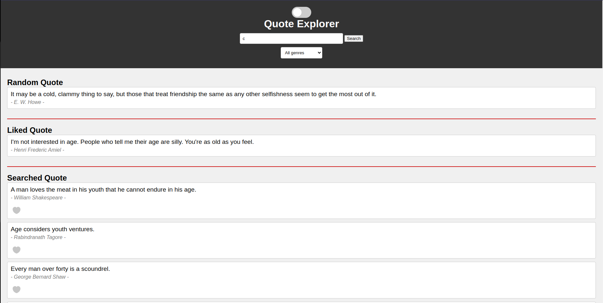

# Quote Explorer

The Quote Explorer is a web application that allows users to explore and discover quotes from a diverse collection of sources. Users can easily access a random quote displayed on the homepage each time they visit the site, search for specific quotes by entering keywords or phrases, and save liked quotes.

Created in **April 2022** as part of the **[Moringa School](https://moringaschool.com/)** curriculum.

## Features

- **Random Quote:** Access a random quote on the homepage each time the site is visited.
- **Search Quotes:** Search for specific quotes by entering keywords or phrases.
- **Save Liked Quotes:** Save quotes that you like for future reference.

## Technologies

- **JavaScript**
- **HTML**
- **CSS**
- **Git**

## Installation

1. Clone this repository using

    ```bash
      git clone git@github.com:migeroreloaded/quote-explorer.git
    ```

    or by downloading a ZIP file of the code.
  
2. The repository, if downloaded as a .zip file will need to be extracted to your preferred location.

3. Navigate to the project folder on your bash terminal.

4. Install dependancies using

    ```bash
      npm install
    ```

## Usage

[**Demo Link**](https://quote-explorer.netlify.app/)

It has been deployed using [Netlify](https://www.netlify.com/)



## Configuration

No specific configurations are needed.

## License

This project is licensed under the MIT License. See the [LICENSE](LICENSE) file for more information.

## Authors

- **Migero**

## Contact

- Email: [mikeroche138@gmail.com](mailto:mikeroche138@gmail.com)

## Project Status

Known issue: When a quote is liked, the love heart icon doesn't remain red indicating it is liked.

Thank you for using Quote Explorer! Let me know if there’s anything else I can help you with.
